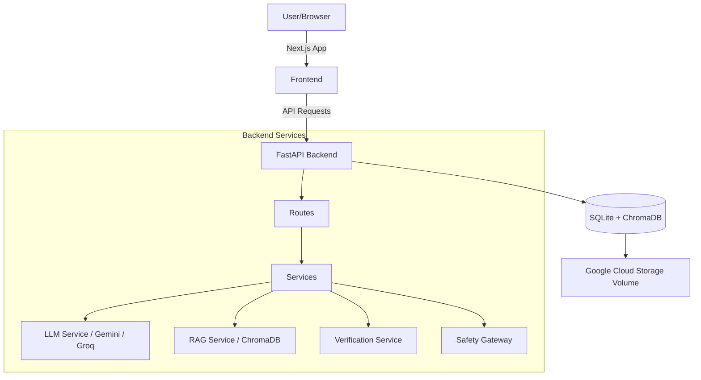

# FaithGuide AI Architecture

## Overview
FaithGuide AI is an agentic, full-stack application designed for accurate, scripture-grounded religious data retrieval and synthesis. The system employs a service-oriented backend and a responsive, client-side frontend.

## High-Level Architecture

## Technology Stack

### Frontend
- **Framework:** Next.js (React)
- **Styling:** TailwindCSS
- **Deployment:** Google Cloud Run (Docker-based)

### Backend
- **Framework:** FastAPI (Python)
- **Database:** SQLite (Relational/Metadata), ChromaDB (Vector Store for RAG)
- **Persistence:** Google Cloud Storage (GCS) FUSE Volume Mount
- **LLM/AI:** Google Gemini (Generative), Groq (Performance Llama 3), HuggingFace (Image Generation)
- **Verification:** Custom `VerificationService` (Async parallel scripture validation)
- **Deployment:** Google Cloud Run (Docker-based)

## Key Architectural Patterns

1.  **Service-Oriented Design:** The backend logic is encapsulated into specialized services (`rag_service`, `gemini_service`, `safety_service`, `verification_service`) to ensure maintainability and testability.
2.  **Safety-First Pipeline:** All user prompts and AI responses pass through a **Safety Gateway** before and after processing to prevent prompt injection, hallucination, or generation of harmful content.
3.  **Parallel Asynchronous Verification:** To minimize latency, scripture citations are extracted and verified in parallel via asynchronous HTTP requests rather than sequential processing.
4.  **Persistent Statelessness:** Although deployed on serverless Cloud Run, the backend achieves state persistence (history/RAG) by mounting a GCS bucket as a local file system.

## Deployment Strategy
- **Decoupled Deployment:** Frontend and Backend are decoupled, connected via build-time and runtime environment variables (`NEXT_PUBLIC_API_URL`).
- **Containerization:** Both services are containerized with Docker and stored in **Google Artifact Registry**.
- **CI/CD:** Orchestrated via **Google Cloud Build** for automated image construction and deployment to **Google Cloud Run**.
- **Data Resilience:** A dedicated Cloud Storage bucket is mounted to the backend container, ensuring SQLite and Vector data survive revision rollouts and container scaling.
